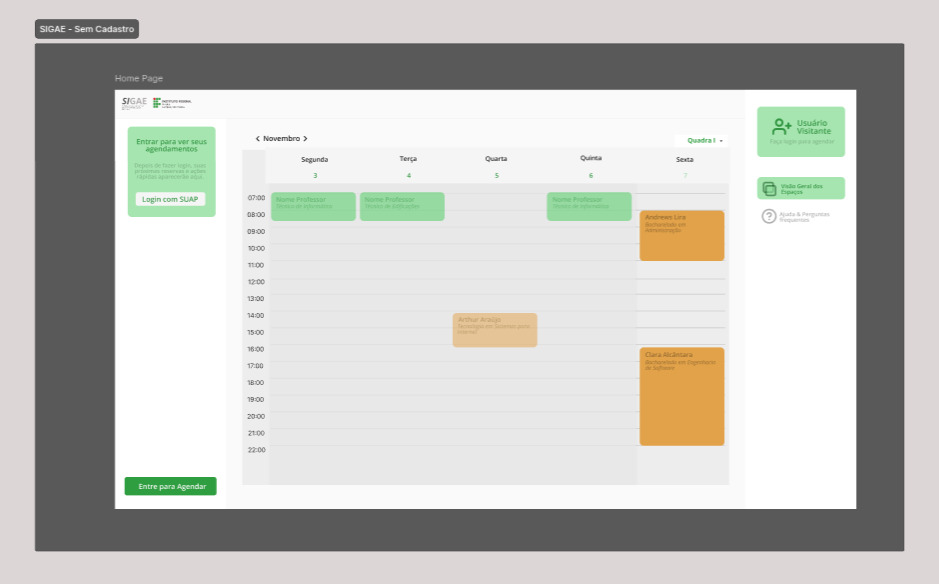
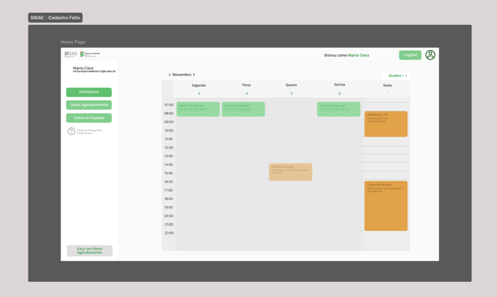

## Requisitos de Software
### Sistema de Gerenciamento e Agendamento de Espaços Esportivos (SIGAE)

*Versão 1.0*

## Histórico de revisões

| Data | Versão | Descrição | Autor(es) |
| :--- | :--- | :--- | :--- |
| 10/11/2025 | 1.0 | Criação do documento (baseado no DVP) | Clara Alcantara, Maria Clara Almeida, Mariana Sarinho |
## Sumário

 

* [Capa](#requisitos-de-software)
    * [Histórico de revisões](#histórico-de-revisões)
    * [Sumário](#sumário)
* [1. Introdução](#1-introdução)
    * [1.1. Definições, Acrônimos e Abreviações](#11-definições-acrônimos-e-abreviações)
* [2. Usuários identificados](#2-usuários-identificados)
* [3. Requisitos funcionais](#requisitos-funcionais)
    * [Módulo de Autenticação e Perfis (Integração SUAP)](#módulo-de-autenticação-e-perfis-integração-suap)
    * [Módulo de Calendário e Consulta](#módulo-de-calendário-e-consulta)
    * [Módulo de Solicitação de Agendamento](#módulo-de-solicitação-de-agendamento)
    * [Módulo de Moderação (Painel de Gestão)](#módulo-de-moderação-painel-de-gestão)
    * [Módulo de Notificações](#módulo-de-notificações)
    * [Módulo de Relatórios e Auditoria (Dashboard)](#módulo-de-relatórios-e-auditoria-dashboard)
* [4. Requisitos não-funcionais](#requisitos-não-funcionais)
    * [4.1. Disponibilidade](#disponibilidade)
    * [4.2. Privacidade e segurança](#privacidade-e-segurança)
    * [4.3. Usabilidade](#usabilidade)
    * [4.4. Suportabilidade (Compatibilidade)](#suportabilidade-compatibilidade)
    * [4.5. Interoperabilidade](#interoperabilidade)
    * [4.6. Manutenibilidade](#manutenibilidade)
    * [4.7. Desempenho](#desempenho)
    * [4.8. Implementação](#implementação)
    * [4.9. Implantação](#implantação)

---

# 1. Introdução

O objetivo deste documento é apresentar os requisitos de software do produto *Sistema de Gerenciamento e Agendamento de Espaços Esportivos (SIGAE)*.

## 1.1. Definições, Acrônimos e Abreviações

Esta subseção fornece as definições de todos os termos, acrônimos e abreviações necessárias à adequada interpretação do Documento de Requisitos.

### Identificação dos requisitos
Por convenção, a referência a requisitos é feita através do identificador de requisitos, de acordo como descrito abaixo:

[IDENTIFICADOR DO TIPO DE REQUISITOSidentificador do requisito]

O identificador do tipo de requisitos é conforme abaixo:
* *RF* – Requisito Funcional
* *RNF* – Requisito Não-Funcional
* *NR* – Não-Requisito

O identificador do requisito será uma sequência numérica. Esse número sequencial será único para todo o conjunto de tipos de requisitos.
*Exemplo:* RF001, RF002, RNF001, NR001

### Termos Específicos do Projeto

| Termo | Definição |
| :---: | :--- |
| *SIGAE* | Sistema de Gerenciamento e Agendamento de Espaços Esportivos |
| *DCE* | Diretório Central dos Estudantes. Entidade que modera os agendamentos dos alunos. |
| *CEF* | Coordenação de Educação Física. Entidade administradora dos espaços e horários. |
| *SUAP*| Sistema Unificado de Administração Pública. Usado para autenticação dos usuários. |
| *Aluno* | Estudante do IFPB, usuário final que fará as solicitações de agendamento. |

### Atributos dos Requisitos
Os atributos de requisitos estabelecidos são:

* *Requisitos vinculados:* fornece uma lista dos requisitos que mantêm rastreabilidade.
* *Prioridade:* Essencial, Importante, Desejável.
* *Complexidade:* Complexa, Alta, Média ou Baixa.
* *Risco:* Alto, Médio, Baixo.

---

# 2. Usuários identificados

Os seguintes perfis de usuários foram identificados para o sistema:

* *Administrador (CEF)*
    * Responsável pela gestão principal dos espaços, configuração do sistema, bloqueio de horários (aulas, manutenção) e gestão de todos os agendamentos. Possui permissão total.
* *Moderador/Gestor (DCE)*
    * Responsável pela operação diária de aprovar ou negar as solicitações de alteração e cancelamento vindas dos alunos.
* *Solicitante (Aluno)*
    * Estudante do IFPB autenticado via SUAP. Pode consultar horários, submeter solicitações de agendamento e gerenciar seus próprios pedidos.
* *Visualizador*
    * Qualquer pessoa (público) que acesse o sistema. Pode apenas visualizar o calendário público e a disponibilidade (livre/ocupado), sem necessidade de autenticação.

# Requisitos funcionais
Os requisitos funcionais são descritos a seguir.

### Módulo de Autenticação e Perfis (Integração SUAP)

- [RF001] - Como Usuário (Aluno, DCE, ADM CEF), eu gostaria de poder realizar login no sistema informando meu usuário (matrícula ou SUAP) e senha, para acessar as funcionalidades permitidas para meu perfil.

- [RF002] - Como usuário, ao clicar em 'Esqueci minha senha', eu gostaria de ser redirecionado para o sistema de recuperação de senha do SUAP

- [RF003] - Como Administrador CEF, eu gostaria de poder gerenciar os perfis de usuário do sistema (ex: "Aluno", "DCE", "CEF") e definir quais permissões específicas cada perfil possui.

- [RF004] - Como usuário, eu gostaria de poder realizar logout (sair) do sistema de forma segura, para encerrar minha sessão.

### Módulo de Calendário e Consulta

- [RF005] - Como usuário, eu gostaria de visualizar os horários disponíveis dos espaços esportivos do meu campus, identificando-os claramente como: "Disponível" ou "Indisponível" (agendamentos já confirmados), entre os horários possíveis (7h às 22h).

- [RF006] - O sistema deve permitir a visualização do calendário de horários (RF005) publicamente, sem a necessidade de autenticação

### Módulo de Solicitação de Agendamento

- [RF007] - Como aluno, eu gostaria de poder  submeter um agendamento em um espaço esportivo do campus dentro de um horário previamente identificado como "Disponível".

- [RF008] - Como sistema, eu gostaria de poder negar ou aceitar solicitações de agendamento feitas por usuários.

### Módulo de Moderação (Painel de Gestão)

- [RF009] - Como DCE, eu gostaria de poder aprovar a nova solicitação de alteração de agendamento ou negar todas as solicitações de alteração e cancelamento pendentes.

- [RF010] - Como Aluno, eu gostaria de poder solicitar o cancelamento do meu agendamento com antecedência mínima de 24 horas, conforme as regras do sistema, apresentando justificativa válida.

- [RF011] - Como DCE, eu gostaria de alterar mediante uma solicitação do aluno, todos os horários agendados dentro do período permitido (7h às 22h), exceto aqueles com a flag “aulas curriculares”.

- [RF012] - Como Administrador CEF, eu gostaria de poder criar um agendamento/bloqueio diretamente no calendário (sem uma solicitação de aluno), para reservar horários de "aulas curriculares", manutenção ou eventos.

- [RF013] - Como Administrador CEF, eu gostaria de aplicar flags em todos os horários agendados, sendo elas: aula curricular, projeto de ensino de professores com equipes oficiais do IFPB, aluno do ensino superior e pessoa externa (como federação esportiva).

- [RF014] - Como Administrador CEF, eu gostaria de excluir horários agendados, independentemente da flag, mediante justificativa válida apresentada pelo usuário responsável pelo agendamento.

- [RF015] - Como Administrador DCE, eu gostaria de excluir horários agendados, exceto aqueles com a flag “aula curricular”, mediante justificativa válida apresentada pelo usuário responsável pelo agendamento.

- [RF016] - Como Administrador CEF, eu gostaria de gerenciar usuários, incluindo liberar ou suspender permissões de agendamento conforme critérios internos.

- [RF017] - Como Administrador CEF, eu gostaria de aceitar ou negar solicitações de alteração de horário dos alunos, conforme as regras do sistema, se apresentadas justificativas válidas.

- [RF018] - Como aluno, eu gostaria de poder solicitar a alteração de horário ou do espaço esportivo presentes no meu agendamento com antecedência mínima de 24 horas, conforme as regras do sistema, apresentando justificativa válida. 

### Módulo de Notificações

- [RF019] - Como aluno, eu gostaria de receber uma notificação por e-mail sobre alteração ou cancelamento. (ex: "Horário cancelado", “horário alterado”) e também sobre alteração ou cancelamento.

Módulo de Relatórios e Auditoria (Dashboard)

- [RF020] - Como Administrador CEF, eu gostaria de gerar relatórios semanais e mensais sobre a utilização dos espaços esportivos, a fim de realizar análises de uso.

- [RF021] - Como Administrador CEF, eu gostaria de visualizar um painel ou lista com todos os agendamentos aprovados.

- [RF022] - Como DCE, eu gostaria de armazenar termos de responsabilidade com a confirmação da entidade solicitante do espaço esportivo, visando prevenir danos ao local ou eventuais acidentes.

- [RF023] - O sistema deve registrar um log de auditoria para todas as ações críticas (ex: solicitação, aprovação, negação, exclusão), armazenando quem realizou a ação e quando.

 

# Requisitos não-funcionais

Os requisitos não-funcionais são descritos a seguir.

## Disponibilidade

- [RNF001] - O sistema deve estar disponível para consulta e solicitação de agendamentos 24 horas por dia, 7 dias por semana, 365 dias por ano.

- [RNF002] - O sistema deve ser desenvolvido de forma que possa ser escalável, ou seja, deve ser possível aumentar a capacidade de processamento de requisições sem que haja perda de desempenho em períodos de alta demanda (como inícios de semestre).

## Privacidade e segurança

- [RNF003] - O sistema deve ser desenvolvido de forma que os dados dos usuários (alunos e administradores) sejam protegidos e não sejam acessíveis por terceiros não autorizados.

- [RNF004] - O sistema deve atender aos requisitos de privacidade da LGPD (Lei Geral de Proteção de Dados).

- [RNF005] - O sistema deve possuir controle de permissões por perfil de usuário (Aluno, DCE, ADM CEF) para limitar o acesso às funções.

- [RNF006] - O sistema deve garantir que as senhas dos usuários sejam armazenadas de forma criptografada, impossibilitando a recuperação da senha original.

- [RNF007] - Toda a comunicação entre o cliente (navegador) e o servidor deve ser feita utilizando criptografia de conexão.

## Usabilidade

- [RNF008] - O sistema deve ser desenvolvido de forma que seja fácil de usar e de fácil aprendizado, de forma que os usuários não precisem de treinamento extensivo para utilizá-lo.

- [RNF009] - O design da interface do sistema será semelhante ao do HIFPB (https://joaopessoa.ifpb.edu.br/horario/) para reaproveitar o reconhecimento e a familiaridade dos usuários (alunos e funcionários do IFPB).

- [RNF010] - O sistema deve ser desenvolvido de forma que possa ser acessado por pessoas com deficiência, seguindo padrões básicos de acessibilidade web.

## Suportabilidade (Compatibilidade)

- [RNF011] - O sistema deve ser desenvolvido de forma que possa ser executado nos três principais navegadores da web: Google Chrome, Mozilla Firefox e Microsoft Edge.

- [RNF012] - O sistema deve ser compatível com os sistemas operacionais mais comuns para computadores e notebooks: Windows e Linux.

## Interoperabilidade

- [RNF013] - O sistema deve ser desenvolvido de forma que possa ser integrado com o sistema de autenticação central do IFPB (ex: SUAP) para validar o login de Alunos e Administradores.

## Manutenibilidade

- [RNF014] - O sistema deve ser desenvolvido de forma que possa ser facilmente atualizado e mantido.

- [RNF015] - O sistema deve ser desenvolvido de forma que possa ser facilmente testado e validado, de forma manual e automatizada.

- [RNF016] - O sistema deve ser documentado (código-fonte, APIs e arquitetura) de forma que possa ser facilmente compreendido por terceiros e para facilitar a manutenção.

## Desempenho

- [RNF017] - O sistema deve ter um tempo de resposta de no máximo 5 segundos para carregar o calendário de horários e submeter uma solicitação de agendamento.

- [RNF018] - O sistema deve ser leve e ter bom desempenho em computadores com especificações básicas, conforme o perfil dos equipamentos disponíveis para os usuários.

- [RNF019] - A interface deve ser simples, sem gráficos pesados, e compatível com resoluções comuns de tela.

## Implementação

- [RNF020] - O sistema deve ser desenvolvido com APIs de acesso aos dados para que o front-end seja desacoplado do back-end.

## Implantação

- [RNF021] - O sistema deve ser desenvolvido de forma que possa ser implantado em plataformas de servidor padrão (Linux, com hardware x64).

### Wireframes do SIGAE

Esta seção apresenta os wireframes desenvolvidos para as principais interfaces do **Sistema de Gerenciamento e Agendamento de Espaços Esportivos (SIGAE)**, demonstrando a estrutura visual e o fluxo de interação das funcionalidades de **consulta de calendário e solicitação de agendamento**.

### Interface do Calendário (Home Page)

A interface principal do calendário (Home Page) é o ponto central para a consulta de horários. A tela foi projetada para facilitar a visualização da disponibilidade pelo usuário (seja um **Visualizador** público ou um **Solicitante/Aluno** logado). A interface foi projetada considerando os requisitos funcionais **[RF005]** (visualizar horários disponíveis) e **[RF006]** (visualização pública sem autenticação).

**Figura 1 - Wireframe da Tela Principal (Home Page / Visão Geral dos Espaços)**

**Elementos principais:**

* **Calendário de Agendamentos:** Exibição da grade de horários em visualização semanal (Segunda a Sexta, 07:00 às 22:00), mostrando os blocos de horários já ocupados.
* **Navegação e Filtros:** Controles para navegar entre as semanas (ex: "< Novembro >") e um seletor para filtrar pelo espaço esportivo desejado (ex: "Quadra 1").
* **Painel de Acesso:** Menu lateral que identifica o perfil do usuário (ex: "Usuário Visitante") e apresenta as ações de "Login com SUAP" e "Entrar para ver seus agendamentos".
* **Botões de Ação:** Botão principal de "Entrar para Agendar" posicionado de forma clara para guiar o usuário ao fluxo de solicitação.
  
### Após o login

Após o usuário realizar o login via SUAP, o sistema apresenta a **Home Page** principal do usuário autenticado. O wireframe abaixo exemplifica a tela principal para o perfil **'Solicitante' (Aluno)** (ex: "Maria Clara"), conforme requisitos como **[RF001]** (Login), **[RF004]** (Logout), **[RF005]** (Visualizar calendário) e **[RF007]** (ação "Faça um Novo Agendamento").

**Figura 2 - Wireframe da Home Page do usuário logado (Perfil 'Solicitante')**

**Elementos principais:**

* **Menu de Navegação Lateral:** Painel principal do usuário logado, com links para "Dashboard", "Meus Agendamentos", "Todos os Espaços" e "Dúvidas & Respostas Frequentes".
* **Calendário de Ocupação:** Grade visual central exibindo os horários da semana e os blocos já reservados (ex: aulas de professores e outros agendamentos).
* **Controles do Calendário:** Filtro para selecionar o espaço (ex: "Quadra 1") e setas de navegação do mês (ex: "< Novembro >").
* **Gestão de Perfil:** Informação do usuário logado ("Enrou como Maria Clara") e botão de "LogOut".
* **Ações Disponíveis:** Botão principal de "call-to-action" para o fluxo de solicitação ("Faça um Novo Agendamento").
* **Indicadores Visuais:** Uso de cores diferentes (verde e laranja) para diferenciar os tipos de agendamento no calendário.
