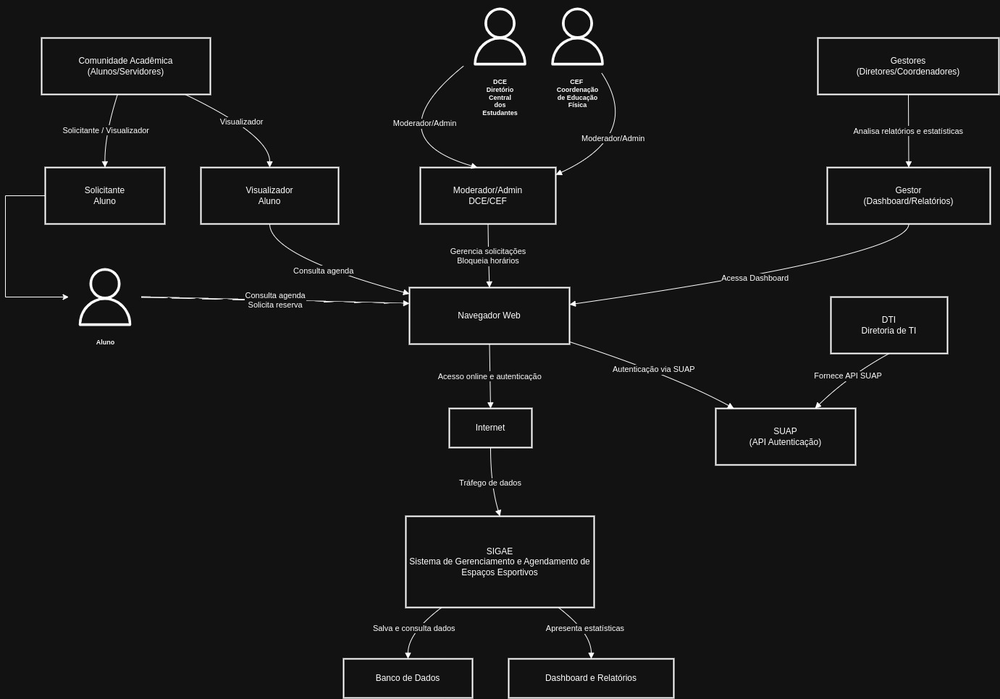

# Visão do Produto
## SIGAE - Sistema de Gerenciamento e Agendamento de Espaços Esportivos 🏐
Versão 1

## Histórico de revisões

| Data       | Versão | Descrição                      | Autor             |
|------------|--------|--------------------------------|-------------------|
| 14/10/2025 | 1.0    | Criação do documento           | Clara Almeida     |
| 15/10/2025 | 1.0    | Edição adicionando benefícos          | Mariana Sarinho      |
| 19/10/2025 | 1.0    | Finalização do documento        |  Clara Almeida       |
| 19/10/2025 | 1.0    | Imagem do fluxo da visão geral    | Clara Alcantara  |
| 19/10/2025 | 1.0    | Revisão Final| Clara Alcantara e Mariana Sarinho |

# Introdução

O Documento de Visão do Produto (DVP) é um documento que descreve o produto de software que será desenvolvido. Ele descreve o problema que será resolvido, as principais necessidades dos stakeholders, as principais funcionalidades do sistema, as restrições do projeto, etc.

## Propósito

O objetivo deste documento é coletar, analisar e definir características e as necessidades de alto nível do **Sistema de Gerenciamento e Agendamento de Espaços Esportivos (SIGAE)**

Ele se concentra nos recursos necessários aos stakeholders e aos usuários, e nas razões que levam a essas necessidades.

Os detalhes de como o **Sistema de Gerenciamento e Agendamento de Espaços Esportivos (SIGAE)** atingem essas necessidades são descritos nas _especificações de casos de uso_ e nos _requisitos funcionais_.

### Abreviações

| Termo | Definição                                    |
| :---: | -------------------------------------------- |
|  DCE  | Diretório Central dos Estudantes                 |
|  CEF  | Coordenação de Educação Física         |

### Definições

|    Termo    | Definição                                                                                                                       |
| :---------: | ------------------------------------------------------------------------------------------------------------------------------- |
|   Diretório Central dos Estudantes | Setor que faz a intermediação da CEF para os estudantes|
|  Coordenação de Educação Física  | Setor responsável pela gestão pedagógica e das atividades que utilizaram os espaços esportivos  |
| Aluno | Estudante do IFPB  |

## Escopo do produto

O **Sistema de Gerenciamento e Agendamento de Espaços Esportivos (SIGAE)** é um sistema que tem como objetivo substituir o método informal e descentralizado (WhatsApp) por uma plataforma centralizada, transparente e automatizada para solicitação, aprovação e consulta de horários de uso das quadras e outros espaços esportivos do campus, utilizando o SUAP como base para autenticação e identificação dos usuários.

# Posicionamento

## Oportunidade de negócios

1.**Centralizar e Formalizar os Pedidos**: Substituir o caos do grupo de WhatsApp e o trabalho manual por um sistema oficial, organizado e justo.

2. **Garantir a Disponibilidade Real**: Mostrar no calendário apenas os horários que estão realmente livres, já descontando as aulas e atividades prioritárias.

3.**Vizualização**: Criar um calendário público onde qualquer aluno ou servidor possa consultar o que está livre ou ocupado em tempo real, acabando com a confusão de informações.

4.**Criar um Registro Digital e de Responsabilidade** : Saber exatamente quem (nome e matrícula) reservou e usou cada horário, permitindo a criação de termos de responsabilidade digitais e tirando o risco das costas do DCE.

## Descrição dos benefícios para os clientes e dos problemas resolvidos

| Benefícios | Problemas Resolvidos | Afetados |
| :--- | :--- | :--- |
| **Automação e Otimização do Tempo** | Processo manual de intermediação, consolidação e distribuição de horários feito pelo DCE, que depende de WhatsApp. | Moderadores/Gestores (DCE e CEF) |
| **Comunicação Eficiente e Clara** | Falta de notificações automáticas sobre o status dos agendamentos (pendente, aprovado, negado). | Solicitantes (Representantes de curso, servidores) |
| **Transparência e Centralização** | Desorganização e "confusão" causadas por informações descentralizadas (Google Agenda e WhatsApp). Professores bloqueiam espaços que acabam não utilizando. | Todos os usuários (Estudantes, Servidores, DCE, CEF) |
| **Responsabilização e Auditoria** | Falta de registro formal de qual indivíduo utilizou o espaço. A responsabilidade por danos recai inteiramente sobre o DCE, que assina termos físicos. | Gestores (DCE, CEF) e Solicitantes |
| **Acesso Justo (Democratização)** | A regra atual de "quem pediu primeiro" no WhatsApp não garante a hierarquia oficial de prioridades (Aulas > Projetos > Alunos), limitando a "democratização" do espaço. | Solicitantes (Representantes de curso) e Gestores/Moderadores (CEF) |

# Descrição dos stakeholders e dos usuários

## Stakeholders
Segue abaixo a lista de stakeholders.

| Stakeholder | Descrição | Papel |
| :--- | :--- | :--- |
| **DCE (Diretório Central dos Estudantes)** | Entidade que representa os estudantes e atua como cliente do sistema. Gerencia o agendamento dos horários livres disponíveis para os membros da comunidade acadêmica. | Cliente, Usuário (Moderador) |
| **CEF (Coordenação de Educação Física)** | Órgão responsável pela gestão principal dos espaços esportivos e gerenciamento do calendário de aulas. | Cliente, Usuário (Moderador) |
| **Comunidade Acadêmica (Alunos e Servidores)** | Todos os membros do campus (professores, técnicos, alunos) que precisam consultar a disponibilidade ou solicitar o uso dos espaços. | Usuários (Solicitante, Visualizador) |
| **Gestores (Diretores/Coordenadores)** | Diretores ou coordenadores que não operam o sistema no dia a dia, mas precisam de relatórios e estatísticas de uso dos espaços. | Consumidor de Relatórios |
| **DTI (Diretoria de Tecnologia da Informação)** | Departamento de TI do campus, responsável por fornecer e dar suporte à API de autenticação e dados do SUAP. | Fornecedor de API / Suporte Técnico |
| **Equipe de Desenvolvimento** | Profissionais responsáveis por desenvolver e manter o sistema SIGAE. | Desenvolvedores |

## Usuários e atores
Segue tabela com os usuários e atores do sistema:
| Usuário | Descrição | Responsabilidades | Stakeholders |
| :--- | :--- | :--- | :--- |
| **Solicitante** | **Qualquer membro da comunidade acadêmica** (alunos e servidores) | • Autenticar-se via SUAP. • Consultar horários livres no calendário. • Preencher e enviar formulário de solicitação. • Acompanhar status dos seus pedidos ("Pendente", "Aprovado", "Negado"). • Cancelar agendamentos aprovados. | DCE, CEF, Comunidade Acadêmica, Equipe de Desenvolvimento |
| **Moderador / Administrador** | Membros do **DCE** e da **CEF** responsáveis pela operação diária e gestão das solicitações no sistema. | • Gerenciar o painel de solicitações pendentes. • Aprovar ou negar solicitações. • Criar agendamentos recorrentes (ex: aulas). • Bloquear horários para manutenção ou eventos. • Configurar regras de agendamento. | DCE, CEF, Gestores, Equipe de Desenvolvimento |
| **Visualizador** | **Qualquer membro da comunidade acadêmica** (alunos e servidores) que precise consultar a agenda. | • Acessar o sistema para visualizar o calendário público de espaços. • Consultar a disponibilidade (horários livres/ocupados). | Comunidade Acadêmica, DCE, CEF, Equipe de Desenvolvimento |
| **Gestor** | **Diretores ou coordenadores** que não operam o sistema no dia a dia, mas consomem dados gerenciais. | • Acessar um painel (dashboard) com gráficos e estatísticas de uso (ex: taxa de ocupação, horários de pico). • Gerar relatórios de uso dos espaços. | Gestores, DCE, CEF, Equipe de Desenvolvimento |

# Descrição do ambiente de uso
## Ambiente de uso

### 1. Ambiente do Usuário (Público e Solicitante):
1.  **Visualizadores** podem acessar publicamente o calendário para consultar a disponibilidade dos espaços.
2.  **Solicitantes (Alunos, servidores)** precisam se autenticar (via SUAP) para submeter pedidos de agendamento.
3.  O acesso será feito através de um navegador web padrão (Google Chrome, Mozilla Firefox, Microsoft Edge, Safari) em dispositivos como computadores, smartphones e tablets.
4.  O sistema será acessado pela internet através de um endereço web (ex: sigae.ifpb.edu.br).
  
### 2. Ambiente de Moderação (Restrito):
5.  **Moderadores** utilizam o sistema para aprovar/negar solicitações, gerenciar o calendário e bloquear horários (ex: aulas).
6.  **Gestores** utilizam o sistema para acessar painéis de estatísticas (dashboards) e gerar relatórios de uso.
7.  Este ambiente é acessado preferencialmente via navegador web em um computador, devido à natureza das tarefas de gerenciamento.
   
### 3. Ambiente de Teste:
8.  O ambiente de teste é acessado através de um navegador web e requer um login de acesso específico para este ambiente.

## Necessidades principais quanto ao ambiente

| Necessidade | Prioridade | Interesse | Solução Atual | Soluções Propostas |
| :--- | :--- | :--- | :--- | :--- |
| **Qualidade:** O sistema deve ser confiável, livre de erros e falhas, garantindo que os agendamentos sejam registrados corretamente sem duplicidade. | **Alta** | A comunidade espera que o sistema seja justo e confiável. Uma falha pode gerar conflitos de horário, como ocorre hoje. | O controle é manual (WhatsApp/Google Agenda) e pode ter erros humanos, desorganização e falhas de comunicação. | Implementar testes automatizados (unitários, integração) e um processo de QA. Realizar Testes de Aceitação do Usuário com o DCE e a CEF. |
| **Desempenho:** O sistema deve ter um tempo de resposta rápido, especialmente na visualização do calendário. | **Alta** | Sendo um recurso de "alta demanda" ("super lotada"), o sistema precisa ser rápido para muitos usuários consultando horários simultaneamente. | O WhatsApp é instantâneo, mas caótico. O Google Agenda é lento para atualizar e consultar. | Otimização de consultas ao banco de dados principalmente para o calendário.|
| **Escalabilidade:** O sistema deve suportar picos de acesso (ex: início de semestre, abertura de agenda) sem lentidão. | **Moderada** | A base de usuários é o campus), mas os picos de acesso simultâneo podem ser altos. | (O sistema atual não é escalável e gera sobrecarga de trabalho manual nos moderadores). | Arquitetura de aplicação e banco de dados otimizada para consultas, hospedada em infraestrutura robusta. |
| **Segurança:** O sistema deve garantir que apenas usuários autorizados possam pedir horários e que apenas Moderadores possam aprovar/negar. | **Alta** | A segurança garante a legitimidade dos pedidos e a integridade do calendário. | Inexistente. O controle de acesso no WhatsApp é frágil e a edição do Google Agenda é centralizada em uma pessoa. | Integração com SUAP para autenticação. Implementar Controle de Acesso para os diferentes perfis (Solicitante, Moderador, Gestor). |
| **Usabilidade:** O sistema deve ser fácil de usar e intuitivo, tanto para solicitar quanto para gerenciar horários. | **Alta** | O sistema precisa ser mais fácil de usar do que o processo atual (WhatsApp) para garantir a adoção pelos usuários. | O WhatsApp é "fácil" de enviar mensagem, mas "difícil" de gerenciar. O Google Agenda não é intuitivo para esse fim. | Prototipação e realização de testes de usabilidade com alunos, DCE e CEF.|
| **Tempo de resposta:** O sistema deve atualizar o calendário (ex: de "livre" para "ocupado") imediatamente após uma aprovação. | **Alta** | A informação precisa ser em tempo real para evitar que dois usuários tentem agendar o mesmo horário vago. | Lento. O processo manual de atualizar o Google Agenda após um pedido no WhatsApp não é em tempo real. | Otimizações de performance  e uso de tecnologias que permitam atualização em tempo real se necessário. |
| **Confidencialidade:** O sistema deve proteger os dados pessoais (nome, matrícula) dos usuários e o histórico de agendamentos. | **Moderada** | Os dados (nome, matrícula) vêm do SUAP e devem ser protegidos. O histórico de uso deve ser acessível apenas por gestores/moderadores. | Insegura. Grupos de WhatsApp expõem números de telefone e informações de todos os membros. | Armazenar o mínimo de dados necessários do SUAP. Garantir que apenas usuários autorizados possam ver os registros. |

## Visão geral do produto

### Visão geral

O sistema SIGAE-Sistema de Gerenciamento e Agendamento de Espaços Esportivos é um sistema web (aplicação web) focado na gestão dos espaços esportivos do IFPB Campus JP. O seu principal objetivo é substituir o método informal e descentralizado de agendamento (atualmente feito pelo WhatsApp) por uma plataforma centralizada e automatizada. O sistema permite que os usuários façam a solicitação, aprovação e consulta de horários de uso das quadras e outros espaços.

Como o SIGAE é um software, a estrutura operacional é baseada em infraestrutura de TI. Sendo assim, a infraestrutura necessária para operar o sistema SIGAE inclui servidores, banco de dados e dispositivos de rede, que podem ser gerenciados pela DTI-Diretoria de Tecnologia da Informação do campus.

O sistema SIGAE será acessado por meio de dispositivos que possuam um navegador web e acesso à Internet, como computadores e dispositivos móveis. Isso permite que os diferentes perfis de usuários acessem e controlem os agendamentos de qualquer lugar, sem a necessidade de instalação de um aplicativo.

A interação entre os dispositivos ocorre por meio de uma conexão de rede. O servidor que hospeda o sistema SIGAE se comunica com os dispositivos dos clientes por meio de solicitações HTTP e respostas, permitindo que o sistema exiba informações e interaja com o usuário.

Além disso, o sistema SIGAE será fundamentalmente integrado com o SUAP. Essa integração ocorrerá por meio de APIs e será utilizada para a autenticação dos usuários e para a importação de dados que foram cadastrados. Em uma fase avançada, o próprio SIGAE poderá desenvolver uma API para que outros sistemas do IFPB possam consultar a disponibilidade dos espaços.

## Custo e venda

### Estimativa de Custo de Desenvolvimento (Projeto de Extensão/Pesquisa)

Uma estimativa dos custos institucionais no desenvolvimento do SIGAE. Esta estimativa é baseada no cenário de que a equipe de desenvolvimento é composta por bolsistas do próprio IFPB, com o projeto tendo uma duração  de 6 meses.

O "custo" do projeto não é um salário de mercado, mas sim o valor do fomento (bolsas) pago pela instituição.

**Alocação de Recursos (Custo de Fomento)**

* **Professor Coordenador/Orientador (1):** Alocação de horas de trabalho, sem custo de bolsa.
* **Desenvolvedor Bolsista - Front-end (1):** Custo de fomento estimado em R$ 700,00/mês. (Total 6 meses: R$ 4.200,00)
* **Desenvolvedor Bolsista - Back-end (1):** Custo de fomento estimado em R$ 700,00/mês. (Total 6 meses: R$ 4.200,00)
* **Designer UI/UX Bolsista - Parcial (1):** Custo de fomento estimado em R$ 700,00/mês. (Total 6 meses: R$ 4.200,00)

**Custo Total de Fomento (Orçamento): R$ 12.600,00**

**Infraestrutura e Ferramentas (Custo Operacional)**

* **Servidores de Hospedagem e Banco de Dados:** Serão utilizados os servidores da própria instituição, gerenciados pela DTI/IFPB. Portanto, são considerados custos internos já absorvidos pela instituição (Custo zero para o projeto).
* **Ferramentas de Gestão:** Serão utilizadas ferramentas gratuitas sem custo adicional.

**Custo Total de Infraestrutura: R$ 0,00**

### Sustentabilidade e "Venda" (Implantação Interna)

Como o SIGAE é um software desenvolvido por bolsistas para a própria instituição, não existe "venda" ou "planos de precificação".
* **Modelo de Uso:** O sistema será **100% gratuito** para todos os usuários da comunidade acadêmica (DCE, CEF, Alunos, Servidores).
* **Propriedade:** O código-fonte e o sistema são de propriedade do IFPB.
* **Sustentabilidade (Manutenção):** A manutenção pós-projeto será de responsabilidade da instituição. A **DTI do IFPB** manterá os servidores no ar, enquanto a **equipe de desenvolvimento** (ou futuros bolsistas/servidores designados) ficará responsável por correções de bugs e melhorias futuras.
  
## Licenciamento e instalação
O produto SIGAE não será licenciado ou vendido, pois é um software de uso interno, desenvolvido pela equipe do projeto para o IFPB Campus João Pessoa. O sistema será de propriedade da instituição.
Após a implantação, o sistema não exigirá instalação por parte dos usuários finais. O acesso será feito diretamente pelo navegador web através de um endereço oficial fornecido pela instituição. O acesso às funcionalidades restritas (solicitar, moderar) será liberado automaticamente com base na autenticação via SUAP, que identificará o perfil de cada usuário. O calendário público vai poder ser acessado por qualquer pessoa com o link.

## Características e funcionalidades de alto nível

Esta seção define e descreve as características do **SIGAE**. Trata-se dos requisitos de alto nível do sistema que são necessários para propiciar benefícios aos usuários.

1. O sistema deve permitir a **autenticação de usuários (Solicitantes, Moderadores) via SUAP** e o gerenciamento (cadastro/edição) dos espaços esportivos disponíveis.
2. O sistema deve permitir que **Solicitantes** (ex: Representantes de Curso) submetam solicitações de agendamento  para os horários disponíveis.
3. O sistema deve exibir um **calendário público** e de fácil visualização, mostrando os horários livres e ocupados de cada espaço.
4. O sistema deve possuir um **painel de solicitação**  onde os Moderadores (DCE, CEF) possam aprovar ou negar as solicitações de agendamento pendentes.
5. O sistema deve **enviar notificações automáticas** (RF09), preferencialmente por e-mail, aos Solicitantes informando o status de seus pedidos (aprovado, negado).
6. O sistema deve **garantir a segurança** das informações e o controle de acesso baseado em perfis (Visualizador, Solicitante, Moderador, Gestor).
7. O sistema deve ter uma **interface de usuário amigável** e de fácil utilização, que seja mais eficiente que o processo atual via WhatsApp.
8. O sistema deve ter um **desempenho satisfatório**, com tempos de resposta rápidos, especialmente no carregamento do calendário, visto que a demanda pelos espaços é "super lotada".
9. O sistema deve possuir um **módulo de registro**  que registre todas as ações (quem pediu, quem aprovou) para fins de responsabilização e geração de histórico.
10. O sistema deve permitir que **Gestores** visualizem um **dashboard com estatísticas** de uso dos espaços.

## Restrições

Algumas restrições que se aplicam ao sistema SIGAE são:

1.  **Restrição de Tempo:** O sistema deve ser desenvolvido e entregue no prazo estipulado no projeto.
2.  **Restrições de Infraestrutura e Plataforma:** O sistema deve ser desenvolvido como uma aplicação web responsiva, capaz de funcionar em computadores e celulares. Ele será hospedado na infraestrutura de servidores do IFPB, gerenciada pela DTI.
3.  **Restrições de Segurança e Privacidade:** O sistema deve atender aos requisitos de segurança, como proteção contra acesso não autorizado, e à privacidade de dados, porque irá manipular informações pessoais dos usuários (nome, matrícula, curso) vindas do SUAP.
4.  **Restrições de Usabilidade:** O sistema deve ser fácil de usar e intuitivo, porque os usuários (Moderadores e Solicitantes) possuem conhecimento técnico básico de informática.
5.  **Restrições de Interoperabilidade:** A implementação dos requisitos Autenticação e Dados do Usuário depende inteiramente da existência e disponibilidade de uma API do SUAP.
6.  **Restrições de Desempenho:** O sistema deve atender aos requisitos de desempenho e disponibilidade. O carregamento do calendário deve ser rápido, visto que a demanda pelos espaços é "super lotada".
7.  **Restrições Geográficas e de Idioma:** O sistema é de uso exclusivo do "IFPB Campus JP". Portanto, deve ser compatível apenas com o fuso horário local e desenvolvido inteiramente no idioma português.

### Alunas Responsáveis pelo projeto 
<table>
  <tr>
    <td align="center">
      
       
      <strong><a href="https://github.com/oiclai" style="text-decoration: none; color: #4CAF50;">Clara Alcantara</a></strong>
    </td>
    <td align="center">
      
       
      <strong><a href="https://github.com/euclaraalmeida" style="text-decoration: none; color: #4CAF50;">Maria Clara Almeida</a></strong>
    </td>
    <td align="center">
      
       
      <strong><a href="https://github.com/marisarinho" style="text-decoration: none; color: #4CAF50;">Mariana Sarinho</a></strong>
    </td>
  </tr>
</table>
